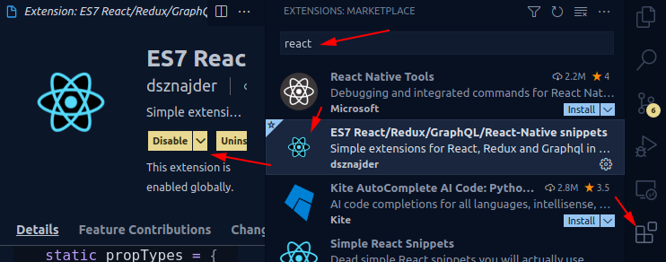
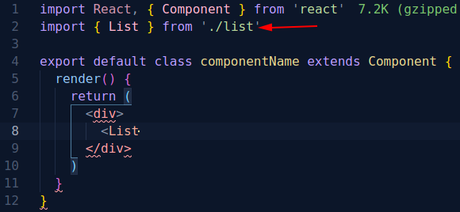

# 20210904 React 前期准备

August 30, 2021 9:31 PM
Teacher Name: Raymond

这篇文章是老师给我们讲的一节tutorial

引用地址：

https://peat-snapper-50a.notion.site/React-3449031b8f9c42d59ea6d4e1d5c9255b

### 项目准备

```jsx
npx create-react-app react-app-js #(js 版本)
```

## 1. 设置绝对定位目录

 根目录下创建 jsconfig.json, 

```json
{
  "compilerOptions": {
    "baseUrl": "src"
  },
  "include": ["src"]
}
```

## 2. 格式统一

使用[Prettier](https://prettier.io/)来格式化项目，(而不是插件，集成在项目中，做到所有开发者统一)

```bash
yarn add --dev --exact prettier  #安装 prettier
echo {}> .prettierrc.json #创建 .prettier 规则json文件
touch .prettierignore #创建 prettier 不需要格式化的忽略文件
code .prettierignore #Vscode(可以用你自己的编辑器) 打开 .prettierignore
```

- 将打开的`**.prettierignore**`文件添加如下内容:

```
build
coverage
```

- 实现提交自动格式化，安装Prettier旗下的[**`Pre-commit Hook`**](https://prettier.io/docs/en/precommit.html)工具

```bash
npx mrm@2 lint-staged  #安装可以根据内容提交时自动格式化的工具
```

- 打开**`package.json`** 文件，可以在最下面看到**`lint-staged`** ，添加到如下状态:

```json
"lint-staged": {
    "*.{js,jsx,ts,tsx,css,scss,sass,md}": "prettier --write"
}
```

- 安装`[**eslint-config-prettier](https://github.com/prettier/eslint-config-prettier#installation)`** 让**`prettier`**和**`eslint`**[格式化兼容](https://prettier.io/docs/en/install.html#eslint-and-other-linters)

[https://github.com/prettier/eslint-config-prettier](https://github.com/prettier/eslint-config-prettier)

```bash
npm install --save-dev eslint-config-prettier
```

- 安装后进入**`package.json`** 文件，找到如下**`eslintConfig`**，添加至如下状态:

```json
"eslintConfig": {
    "extends": [
      "react-app",
      "react-app/jest",
      "prettier"
    ]
  }
```

## 自动化import

这项功能在[**Webstrom**](https://www.jetbrains.com/webstorm/)这种编辑器上是自然存在的。但在[**Vscode**](https://code.visualstudio.com/)需要做一些设置。

- **如何设置**
    - **`Typescript`**工程中设置checkJs为true，注意，编辑器也能设置，但最好不要这样做，因为会造成其他工程一并检查js，会有不必要的麻烦。

        **`tsconfig.json`**中添加:

        ```jsx
        {
          "compilerOptions": {
            "checkJs": true,
          },
        }
        ```

    - **`Javascript`** 工程中自动化import和点击组件能够顺利进入组件都需要设置。

        **`jsconfig.json`**中添加:

        ```jsx
        {
          "compilerOptions": {
            "jsx": "react"
          }
        }
        ```

    - Vscode 选择**`Trigger Expansion On Tab`**开启

        

    - 确保`**wordBasedSuggestionMode**` 为 **`matchingDocuments`** 或者是 **`allDocuments`**

        

    - 安装React快捷模板插件（并非必须，但可以加速开发）

        

    - Vscode Reload

        

- **如何使用**
    - 假设已经有了一个写好的**component**: **list.jsx**

        ```jsx
        export const List = () => {
          return <table></table>
        }
        ```

    - 在 **index.js** 引入它，由于插件Es7 React的功能，我们可以快速展开代码

        

        ```jsx
        import React, { Component } from 'react'

        export default class componentName extends Component {
          render() {
            return (
              <div>
                
              </div>
            )
          }
        }
        ```

    - 此时写入**`<List`** ,注意，此时不要写如后半个括号

        

    - 此时按下Tab让其自动提示。（如果没有设置Tab提示请参考本文[第四建议](https://www.notion.so/React-3449031b8f9c42d59ea6d4e1d5c9255b)）

        

    - 最后输入**`>`** 完成最后的补全

        ```jsx
        import React, { Component } from 'react'
        import { List } from './list'
        
        export default class componentName extends Component {
          render() {
            return (
              <div>
                <List></List>
              </div>
            )
          }
        }
        ```

## 4. 提示使用Tab

- Vscode Setting 中 输入Tab

    

## 5. 规范commit

- 安装[**`commitlint`**](https://commitlint.js.org/#/)

    ```bash
    yarn add -D @commitlint/cli @commitlint/config-conventional
    echo "module.exports = {extends: ['@commitlint/config-conventional']}" > commitlint.config.js
    ```

- 设置husky

    ```bash
    npx husky add .husky/commit-msg "yarn commitlint --edit $1"
    ```

- 规则官网**`[github](https://github.com/conventional-changelog/commitlint/tree/master/@commitlint/config-conventional#type-enum)`**地址

### 6 合并搜索

先想好框架，自上而下，好处是思路清晰，适用于工程复杂的项目。

jsx模块，js逻辑

<>空标签的作用是

## 7 Summary

**专业开发主要时间用在业务而不是一点点敲代码上**

用工具管理人而不是人情世故。准备做team leader加油！！！